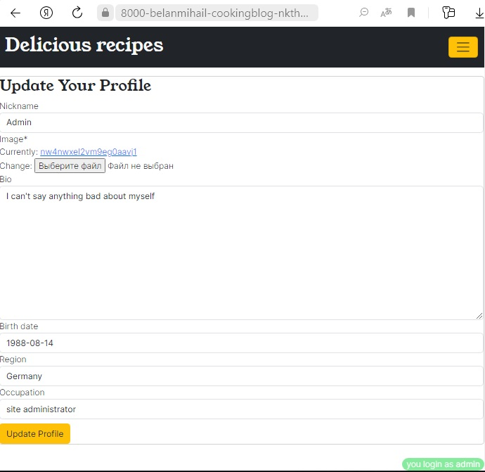
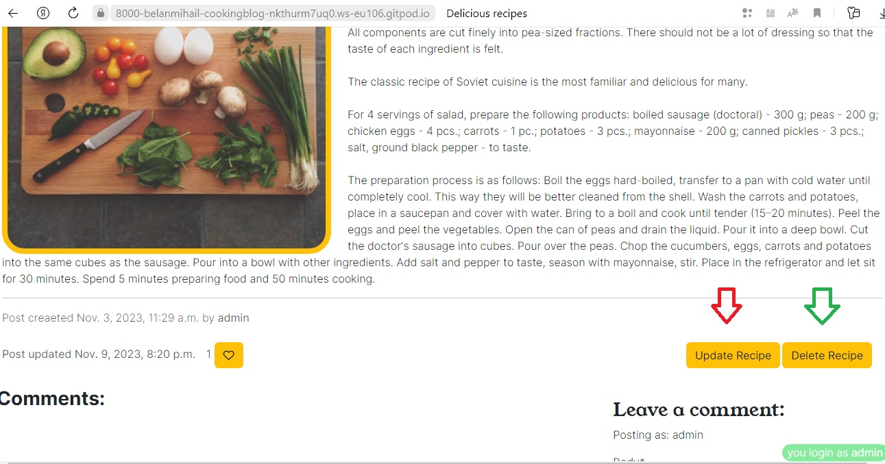
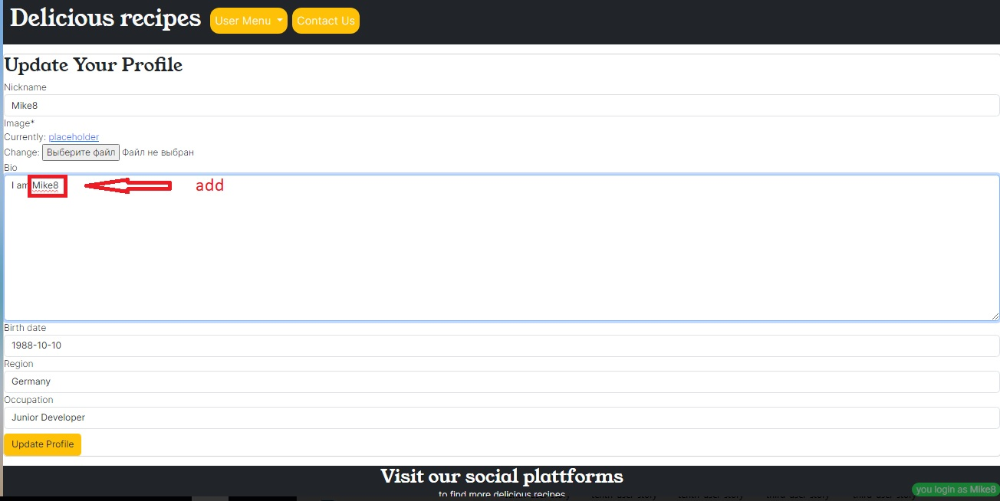

# Delicious recipes
(Developer: Bilan Mykhailo)

[Live webpage](add)

## Table of Content
1. [About Project](#about-project)
2. [Project Goals](#project-goals)
    1. [User Goals](#user-goals)
    2. [Site Owner Goals](#site-owner-goals)
3. [User Experience](#user-experience)
    1. [Target Audience](#target-audience)
    2. [User Requrements and Expectations](#user-requrements-and-expectations)
    3. [User Stories](#user-stories)
    4. [Site Owner Stories](#site-owner-stories)
4. [Design](#design)
    1. [Design Choices](#design-choices)
    2. [Colors](#colors)
    3. [Fonts](#fonts)
    4. [Structure](#structure)
      1. [Home Page](#home-page)
      2. [Create Post Page](#create-post-page)
      3. [Post Detail Page](#post-detail-page)
      4. [Update Post Detail Page](#update-post-detail-page)
      5. [Delete Post Detail Page](#delete-post-detail-page)
      6. [Categories Page](#categories-page)
      7. [Profile Page](#profile-page)
      8. [Update Profile Page](#update-profile-page)
      9. [Create Profile Page](#create-profile-page)
      10. [Contact Page](#contact-page)
      11. [Thanks Page](#thanks-page)
      12. [SignUp Page](#signup-page)
      13. [LogIn Page](#login-page)
      14. [LogOut Page](#logout-page)
    5. [Wireframes](#wireframes)
    6. [Models Used](#models-used)
      1. [User](#user)
      2. [CookingRecipePost](#cookingrecipepost)
      3. [Comment](#comment)
      4. [Category](#category)
      5. [Profile](#profile)
      6. [Contact](#contact)

## About Project
A simple, colorful and interesting website with delicious culinary recipes, where anyone can post a recipe for their favorite dishes or watch, comment and rate recipes posted by other users

## Project Goals

### User Goals

 - Create your own culinary blog
 - View interesting recipes for various dishes
 - Rate and comment on interesting recipes for various dishes

### Site Owner Goals

  - Provide the opportunity for various users to post recipes for their favorite dishes
  - Create a beautiful, easy-to-use website with rich functionality (registration, comments, updates, etc.)

## User Experience

### Target Audience

- People of different ages who want to post a recipe for their favorite dishes or watch, comment and rate recipes posted by other users

### User Requrements and Expectations

- Simple and user-friendly to use
- Interactive interaction with the user (reaction to user actions)
- Fully adaptive and beautiful design
- Accessible navigation, links working as expected

### User Stories 

1. As User I can use navigation bar so that I can easy to navigate the site.
2. As a site user, I want to be able to see a list of all site posts on the main page
3. As a user of the site, I want to be able to view my posts as well as the posts of other users
4. As a site user, I want the post to contain a photo of the dish and a description of the cooking process
5. As a registered user of the site, I want to be able to post, update and delete posts in which I am the author
6. As a registered user of the site, I want to be able to rate posts
7. As a registered user of the site, I want to be able to comment on posts, as well as the ability to delete comments
8. As a site user, I want to see all possible categories of site posts on the main page
9. As a site user, I can select a specific category of posts that are interesting to me
10. As a registered user of the site I can create and update profile page
11. As a registered user of the site, I can see all my published posts on the portfolio page
12. As a user of the site I can see interesting quotes and aphorisms about food
13. As a user of the site, I would like to receive notifications about my actions

### Site Owner Stories

1. As the owner of the site, I want only authorized users to have access to all the functionality of the site
2. As the owner of the site, I want the registered user to be able to update and delete posts only if he is the author
3. As a site owner, I want to be able to pre-approve user posts and comments to avoid publishing inappropriate content
4. As the owner of the site, I want the post to contain a photo of the dish and a description of the cooking process
5. As the owner of the site I can receive feedback from registered users
6. As the owner of the site, I can place links to the project’s social pages on every page of the site

## Design

### Design Choices

The site was created in such a way as to maximize the interest of users and provide the opportunity to easily and simply use the functionality of the site.

### Colors

The main color palette was chosen in accordance with the basic colors of the bootstrap framework. The dark background includes contrasting white font. To draw attention to certain content on the site, two bright accent colors are used

Colour pallet

### Fonts

For plain text, the Mulish font is used, connected using google fonts. For headings, Young Serif font was used. Inter font used for other text. Used fonts are well combined with each other

### Structure

The site structure is designed to ensure maximum ease of use. Also, much attention is paid to the stylistic beauty of the site. All pages of the site have the same header with a navigation menu and a footer containing links to social networks

#### Home Page

- The home page consists of three sections: navigation menu, main section, right additional section and footer.

- The main section displays posts published by site users (main picture, short description of the recipe, date of creation, author and number of likes)

- Right-side section contains a list of post categories, as well as a block with quotes about food.

#### Create Post Page

- The page consists of three sections: header, main section and footer. The footer and header sections are standard for the entire site.

- The main section of the page displays a form with various fields for updating the post.

#### Post Detail Page

- The page consists of three sections: header, main section and footer. The footer and header sections are standard for the entire site

- The main section displays the full text of the post with a cover image on the left and a description on the right. Below is a block with the date the post was created and the author. Below is a block with comments and a comment form for authorized users.

#### Update Post Page

- The page consists of three sections: header, main section and footer. The footer and header sections are standard for the entire site.

- The main section of the page displays a form with various fields for updating the post.

#### Delete Post Page

- The page consists of three sections: header, main section and footer. The footer and header sections are standard for the entire site.

- The main section of the page is a warning about deleting a post and buttons for deleting and canceling

#### Categories Page

- This page uses the home page template, but only displays posts from a specific category

#### Profile Page

- The page consists of three sections: header, main section and footer. The footer and header sections are standard for the entire site.

- The main page is conditionally divided into two parts. The first part contains the user's avatar and brief information about him. The second part contains a list of the user’s posts with a picture and a brief description or, if the user has no posts display a message about the presence and a button to add a post.

#### Update Profile Page

- The page consists of three sections: header, main section and footer. The footer and header sections are standard for the entire site.

- The main section of the page displays a form with various fields for updating the profile.

#### Create Profile Page

- The page consists of three sections: header, main section and footer. The footer and header sections are standard for the entire site.

- The main section of the page displays a form with various fields for creating profile.

#### Contact Page

- The page consists of three sections: header, main section and footer. The footer and header sections are standard for the entire site.

- The main section of the page displays a form with various fields for creating message.

#### Thanks Page

- The page consists of three sections: header, main section and footer. The footer and header sections are standard for the entire site.

- The main section of the page is notification of sending a message and buttons to return to the main page and to write a new message

#### SignUp Page

- The page consists of three sections: header, main section and footer. The footer and header sections are standard for the entire site.

- The main section of the page displays a form with various fields for registrate on the site.

#### LogIn Page

- The page consists of three sections: header, main section and footer. The footer and header sections are standard for the entire site.

- The main section of the page displays a form with various fields for log in on the site.

#### LogOut Page

- The page consists of three sections: header, main section and footer. The footer and header sections are standard for the entire site.

- The main section of the page is notification of leaving the site and button for confirmation 

### Wireframes

Home Page Wireframes

Home Page Fullscreen

Home Page Ipad

Home Page Mobile

Detail Page Wireframes

Detail Page Fullscreen

Deatail Page Ipad

Detail Page Mobile

Add Post Page Wireframes

Add Post Page Fullscreen

Add Post Page Ipad

Add Post Page Mobile

Update Post Page Wireframes

Update Post Page Fullscreen

Update Post Page Ipad

Update Post Page Mobile

Delete Post Page Wireframes

Delete Post Page Fullscreen

Delete Post Page Ipad

Delete Post Page Mobile

Profile Page Wireframes

Profile Page Fullscreen

Profile Page Ipad

Profile Page Mobile

Update Profile Page Wireframes

Update Profile Page Fullscreen

Update Profile Page Ipad

Update Profile Page Mobile

Contact Page Wireframes

Contact Page Fullscreen

Contact Page Ipad

Contact Page Mobile

Thanks Page Wireframes

Thanks Page Fullscreen

Thanks Page Ipad

Thanks Page Mobile

SignUp Page Wireframes

SignUp Page Fullscreen

SignUp Page Ipad

SignUp Page Mobile

Login Page Wireframes

Login Page Fullscreen

Login Page Ipad

Login Page Mobile

Logout Page Wireframes

Logout Page Fullscreen

Logout Page Ipad

Logout Page Mobile

## Database

- For this Django app I ve used PostgreSQL relational database management system.

Database model

### Models Used

#### User

- standard Django user model which contains username, password and email fields

#### CookingRecipePost

- The model was created to provide the user with the ability to create, view, edit and delete posts on the site. this model contains the following fields

- cooking_recipe_title
   - type: CharField
   - validation: max_length=200, unique=True

- slug
   - type: SlugField
   - validation: max_length=200, unique=True 

- cooking_recipe_author
    - type: ForeignKey
    - validation: User, on_delete=models.CASCADE,

- cooking_recipe_image
   - type: CloudinaryField
   - validation: 'image', default='placeholder' 

- excerpt
   - type: TextField
   - validation: blank=True 

- cooking_recipe_body
   - type: TextField
   - validation: -

- updated_on
   - type: DateTimeField
   - validation: auto_now=True 

- created_on
   - type: DateTimeField
   - validation: auto_now_add=True 

- status
   - type: IntegerField
   - validation: auto_now_add=True 

- likes
   - type: ManyToManyField
   - validation: User, blank=True

- cat
   - type: ForeignKey
   - validation: 'Category', on_delete=models.PROTECT

#### Comment

- The model was created to allow user interaction with comments on posts. this model contains the following fields

- cooking_recipe_post
   - type: ForeignKey
   - validation: CookingRecipePost, on_delete=models.CASCADE,

- name
   - type: CharField
   - validation: max_length=80 

- email
    - type: EmailField
    - validation: -

- body
   - type: TextField
   - validation: max_length=500 

- created_on
   - type: DateTimeField
   - validation: auto_now_add=True 

- approved
   - type: BooleanField
   - validation: default=False

#### Category

- The model was created to provide the ability to define categories of posts for their subsequent filtering. this model contains the following fields

- name
   - type: CharField
   - validation: max_length=100, db_index=True

- slug
   - type: SlugField
   - validation: max_length=255, unique=True, db_index=True

#### Profile

- The model was created to allow the user to create a profile with personal information and an avatar, which improves the quality of the user’s interaction with the site. this model contains the following fields

- user
   - type: OneToOneField
   - validation: User, on_delete=models.CASCADE

- nickname
   - type: CharField
   - validation: blank=True, max_length=50

- avatars
   - type: CloudinaryField
   - validation: 'image', default='placeholder'

- bio
   - type: TextField
   - validation: max_length=500, blank=True

- birth_date
   - type: DateField
   - validation: null=True, blank=True

- region
   - type: CharField
   - validation: blank=True, max_length=50

- occupation
   - type: CharField
   - validation: blank=True, max_length=50

#### Contact

- The model was created to allow user interaction with comments on posts. this model contains the following fields

- name
   - type: CharField
   - validation: max_length=120 

- email
    - type: EmailField
    - validation: -

- message
   - type: TextField
   - validation: max_length=1000 

### Agile 

- steps taken:
   1. created User Story Template
   

User story template

   
   

   2. project created [Link to project](https://github.com/users/Belan-Mihail/projects/5/)
   3. based on the user story template, issues were created. A total of 41 issues were created the main part of which was created at the very beginning of the project development process, others during the development process (which corresponds to the principles of agile development)
   

Issues

   
   

   4. main labels have been created for marking issues and marked issues in accordance with Moscow Prioritisation
   5. Kanban Board was created to visualize the process of completing tasks
   

Kanban Board

   
   

- This project was the first time I used agile development methods. The importance of these principles is beyond doubt. There may have been certain inaccuracies in the use of all the principles of this methodology.

## Features

### Blocks are typical for all pages

#### Logo and Navbar

- A navigation bar is displayed on all pages for easy navigation around the site.
- The navigation bar consists of the site logo (which is a link to the main page) and a drop-down link containing links to the login and registration pages.
- An authenticated user (without a profile) sees other links in the drop-down link block:
      - Profile creation page
      - Link to the exit page from the site
      - Add post page
- Additionally, for an authorized user, a link to the contact page appears
- An authenticated user (having a profile), instead of a link to the profile creation page, sees a link to the profile page in the drop-down link block
- The navigation bar is adaptive and turns into a “hamburger menu” on small screens.

- User Story covered with this feature: 1, 5, 10
- Site Owner Story covered with this feature: 1, 5

#### Footer

- The footer is displayed on all pages of the site

- The footer contains links to social networks that open in a new tab.

- Site Owner Story covered with this feature: 6

### Blocks are not typical for all pages

#### Home Page (Features)

- The main page consists of three sections: navigation menu, main section, right additional section and footer.

- The main section displays posts published by site users (main picture, short description of the recipe, date of creation, author and number of likes)

- Right-side section contains a list of post categories, as well as a block with quotes about food.

- For authorized users, a stick notification about authorization is displayed in the right corner

- When the user performs authorization and other actions as a result of which he is redirected to the main page, a notification appears about the implementation of the corresponding actions by the user

- If the number of posts on the main page exceeds 5, the page pagination function is triggered

- User Story covered with this feature: 2, 4, 8, 10, 12,

#### Create Post Page (Features)

- The page consists of three sections: header, main section and footer. The footer and header sections are standard for the entire site.

- The main section of the page displays a form with various fields for updating the post.

- This page is available only to authorized site users

- After creation, the post is initially submitted for approval to the administration (about which a notification is displayed to the user) and the user is redirected to the main page of the site

- User Story covered with this feature: 1, 5, 10
- Site Owner Story covered with this feature: 1, 3

#### Detail Post Page (Features)

- The page consists of three sections: header, main section and footer. The footer and header sections are standard for the entire site.

- The main section displays the full text of the publication with a cover image on the left and a description on the right. Below is a block with the date the post was created and the author, as well as the number of likes the user received. A block with comments is displayed even lower. The likes function is not available for non-authorized users.

- An authorized user who is not the author of the post also sees the comment form. The likes function is available for such a user

- For an authorized user who is the author of the post, buttons to update the recipe and delete the recipe are additionally displayed.

- For the user who is the author of the comment, a button to delete the comment is additionally displayed.

- After adding a comment, the comment requires approval by the administrator (about which a notification is displayed to the user)

- User Story covered with this feature: 3, 4, 5, 6, 7, 13
- Site Owner Story covered with this feature: 1, 2, 3, 4

#### Update Post Page (Features)

- The page consists of three sections: header, main section and footer. The footer and header sections are standard throughout the site.

- The main section of the page displays a form with various fields for updating the publication.

- This page is available only to authorized users of the site who are the authors of the post

- After updating, the post is initially submitted for approval to the administration (about which the user is notified) and the user is redirected to the main page of the site.

- User history covered by this feature: 5, 13.
- History of the site owner covered by this function: 1, 3.

#### Delete Post Page (Features)

- The page consists of three sections: header, main section and footer. The footer and header sections are standard throughout the site.

- The main section of the page is a warning about deleting a post and buttons for deleting and canceling

- This page is available only to authorized users of the site who are the authors of the post

- User history covered by this feature: 5, 13.
- History of the site owner covered by this function: 1, 3.

#### Categories Page (Features)

- This page uses the home page template, but only displays posts from a specific category

- User history covered by this feature: 9

#### Create Profile Page (Features)

- The page consists of three sections: header, main section and footer. The footer and header sections are standard for the entire site.

- The main section of the page displays a form with various fields for creating profile.

- The page is only available to registered users without a profile

- User history covered by this feature: 10, 11
- History of the site owner covered by this function: 1,

#### Profile Page (Features)

- The page consists of three sections: header, main section and footer. The footer and header sections are standard for the entire site.

- - The main page is conditionally divided into two parts. The first part contains the user's avatar and brief information about him. The second part contains a list of the user’s posts with a picture and a brief description or, if the user has no posts display a message about the presence and a button to add a post.

- The page is only available to registered users with a created profile

- User history covered by this feature: 10, 11
- History of the site owner covered by this function: 1,

#### Update Profile Page (Features)

- The page consists of three sections: header, main section and footer. The footer and header sections are standard for the entire site.

- The main section of the page displays a form with various fields for updating the profile.

- Due to the fact that the link to the page button is located on the profile page, access to the page is possible only for an authorized user who is the owner of the profile

- User history covered by this feature: 10
- History of the site owner covered by this function: 1,

#### Contact Page

- The page consists of three sections: header, main section and footer. The footer and header sections are standard for the entire site.

- The main section of the page displays a form with various fields for creating message.

- The page is only available to registered users

- After sending the message the user is taken to the thanks page

- History of the site owner covered by this function: 5

#### Thanks Page

- The page consists of three sections: header, main section and footer. The footer and header sections are standard for the entire site.

- The main section of the page is notification of sending a message and buttons to return to the main page and to write a new message

- The page is only available to registered users

- User history covered by this feature: 13
- History of the site owner covered by this function: 1, 5

#### SignUp Page

- The page consists of three sections: header, main section and footer. The footer and header sections are standard for the entire site.

- The main section of the page displays a form with various fields for registrate on the site.

- History of the site owner covered by this function: 1

#### LogIn Page

- The page consists of three sections: header, main section and footer. The footer and header sections are standard for the entire site.

- The main section of the page displays a form with various fields for registrate on the site.

- History of the site owner covered by this function: 1

#### LogOut Page

- The page consists of three sections: header, main section and footer. The footer and header sections are standard for the entire site.

- The main section of the page displays a notification of leaving the site as well as the corresponding button.

- History of the site owner covered by this function: 1

## Technologies Used

### Languages & Frameworks

- HTML
- CSS
- Javascript
- JQuery
- Boostrap 5
- Python 3.12.0
- Django 3.2

### Libraries & Tools

- [Am I Responsive](http://ami.responsivedesign.is/) was usedfor creating mock-up 
- [Cloudinary](https://cloudinary.com/) to store static images files
- [Summernote](https://summernote.org/) to style the admin page 
- [Balsamiq](https://balsamiq.com/) to create the projects wireframes
- [Bootstrap 5](https://getbootstrap.com/). to style various website components
- [Api Ninjas](https://api-ninjas.com/) to displaying food quotes on the home page
- [Favicon.io](https://favicon.io) for site favicon
- [Chrome dev tools](https://developers.google.com/web/tools/chrome-devtools/) was used for checking sites components styles 
- [GitPod](https://www.gitpod.io/) was used for writing code.
- [GitHub](https://github.com/) was used as a remote repository to store project code
- [Google Fonts](https://fonts.google.com/) - for typography in project
- [Fontawesome](https://fontawesome.com/) - for displaying beautiful icons on the site (for example, like hearts)
- [Coolors](https://coolors.co/) - to create a color palette for the site

## Validation

## Testing

### User Story Testing

   1. As User I can use navigation bar so that I can easy to navigate the site

   **Action** | **Result** 
 -----------| ----------  
 1.Being on the any site pages, on the top of the page you can see navbars. | By clicking on the buttons you can easily navigate the site 

Screenshot evidences

 

---

   2. As a site user, I want to be able to see a list of all site posts on the main page

   **Action** | **Result** 
 -----------| ----------  
 While on any page of the site, go to the main page and click on the logo located in the right-left corner of the page. | The main page of the site displays a list of all posts with pagination every 5 posts 

Screenshot evidences

---

   3. As a user of the site, I want to be able to view my posts as well as the posts of other users

   **Action** | **Result** 
   -----------| ----------  
 While on the main page of the site, you can select any post that interests you. | Click on the corresponding picture and you will be taken to the corresponding post page

Screenshot evidences

---

   4. As a site user, I want the post to contain a photo of the dish and a description of the cooking process

   **Action** | **Result** 
   -----------| ----------  
 While on the main page of the site, you can select any post that interests you and click. | On the post detail page you will see a picture of the recipe and a description of the recipe

Screenshot evidences

---

   5. As a registered user of the site, I want to be able to post, update and delete posts in which I am the author

   **Action** | **Result** 
   -----------| ----------  
 While on any page of the site, click on the login or register button in the navigation menu and fill out the appropriate form | A button for adding a post will become available in the navigation menu 
 Go to the page of the corresponding post | The delete and update post buttons will be available
 Click on the button you are interested in. |Depending on what you have chosen, you will be taken to the post deletion page or the post update page |
 When on the post update page, fill out the fields you are interested in and click the update post button | You will be redirected to the main page of the site, where you will receive a notification that your updated post has been sent to the administrator for approval | 
 When you are on the post deletion page, click on the button to confirm the deletion | Your post will be deleted

Screenshot evidences

---

   6. As a registered user of the site, I want to be able to rate posts

   **Action** | **Result** 
   -----------| ----------  
 While on any page of the site, click on the login or register button in the navigation menu and fill out the appropriate form | A button for adding a post will become available in the navigation menu 
 Go to the page of the corresponding post | To rate a post, click on the heart icon.

Screenshot evidences

---

   7. As a registered user of the site, I want to be able to comment on posts, as well as the ability to delete comments

   **Action** | **Result** 
   -----------| ----------  
 While on any page of the site, click on the login or register button in the navigation menu and fill out the appropriate form | A button for adding a post will become available in the navigation menu 
 Go to the page of the corresponding post | To add a comment, fill out the form and click the add comment button. You will receive notifications that your comment must be approved. after approval, the comment will appear on the site
 While on the page of a previously commented post, click on the delete comment button | Your comment will be deleted

Screenshot evidences

---

   8. As a site user, I want to see all possible categories of site posts on the main page

   **Action** | **Result** 
   -----------| ----------  
 While on any page of the site, go to the main page and click on the logo located in the right-left corner of the page. | Possible categories of posts are displayed on the right side of the page 

Screenshot evidences

---

   9. As a site user, I can select a specific category of posts that are interesting to me

   **Action** | **Result** 
   -----------| ----------  
 While on any page of the site, go to the main page and click on the logo located in the right-left corner of the page. | Possible categories of posts are displayed on the right side of the page
 Click on the post category you are interested in  | Posts in this category will be displayed 

Screenshot evidences

---

   10. As a registered user of the site I can create and update profile page

   **Action** | **Result** 
   -----------| ----------  
 As a user who does not have a profile, go to the profile creation page | You will be taken to the profile creation page
 Fill out the profile form and click on the create profile button  | Your profile will be created
 To update your profile, go to your profile page | Your profile will be shown
 While on the profile page, click on the update profile button  | The profile update page will open
 Fill out the profile update form and click on the update button | Your profile will be updated

Screenshot evidences

---

<!-- 1. As User I can use navigation bar so that I can easy to navigate the site.

10. As a registered user of the site I can create and update profile page
11. As a registered user of the site, I can see all my published posts on the portfolio page
12. As a user of the site I can see interesting quotes and aphorisms about food
13. As a user of the site, I would like to receive notifications about my actions

### Site Owner Stories

1. As the owner of the site, I want only authorized users to have access to all the functionality of the site
2. As the owner of the site, I want the registered user to be able to update and delete posts only if he is the author
3. As a site owner, I want to be able to pre-approve user posts and comments to avoid publishing inappropriate content
4. As the owner of the site, I want the post to contain a photo of the dish and a description of the cooking process
5. As the owner of the site I can receive feedback from registered users
6. As the owner of the site, I can place links to the project’s social pages on every page of the site -->
